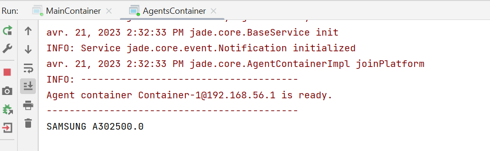

# les ontologies

In this TP We will create an application to exchange objects between agents we use the Sln  language.

 However, we can define our own vocabulary and semantics for the content of messages exchanged between our agents. it is a question of defining an ontology. 

When defining an ontology, we will generally deal with the three interfaces Concept, AgentAction and Predicate. The corresponding classes to use AgentActionSchema and PredicateSchema. 


## Concept classes 
### Product classe
The "Product" class implements the "Concept" interface. The "Product" class has two private variables: "name" (product name) and "price" (product price). Variables are encapsulated with access (getters) and modification (setters) methods. The implementation of the "Concept" interface means that the "Product" class has methods to describe what is a concept in general.
```
public class Product implements Concept {
    private String name;
    private float price;

    public Product() {
    }

    public String getName() {
        return this.name;
    }

    public void setName(String name) {
        this.name = name;
    }

    public float getPrice() {
        return this.price;
    }

    public void setPrice(float price) {
        this.price = price;
    }
}

```
### Computer Classe
The "Computer" class that extends the "Product" class has three private variables: "ram" (amount of RAM), "disk" (size of disk) and "processors" (number of processors). Variables are encapsulated with access (getters) and modification (setters) methods.

```
public class Computer extends Product {
    private float ram;
    private float disk;
    private int processors;

    public Computer() {
    }

    public float getRam() {
        return this.ram;
    }

    public void setRam(float ram) {
        this.ram = ram;
    }

    public float getDisk() {
        return this.disk;
    }

    public void setDisk(float disk) {
        this.disk = disk;
    }

    public int getProcessors() {
        return this.processors;
    }

    public void setProcessors(int processors) {
        this.processors = processors;
    }
}
```
### USB Classe
The "Usb" class extends the "Product" class. It has a private variable "capacity" (storage capacity) and is encapsulated with access methods (getters) and modification methods (setters).
```
public class Usb extends Product {
    private float capacity;

    public Usb() {
    }

    public float getCapacity() {
        return this.capacity;
    }

    public void setCapacity(float capacity) {
        this.capacity = capacity;
    }
}

```
## Predicate classes
### Disponible Classe
The "Disponible" class implements the "Predicate" interface. The "Disponible" class has two private variables: "seller" (vendor identifier) and "product" (product available from the vendor). Variables are encapsulated with access (getters) and modification (setters) methods.  The implementation of the "Predicate" interface means that the "Disponible" class has methods to evaluate whether a certain condition is true or false. This can be used to filter products available at vendors based on certain criteria.
```
import jade.content.Predicate;
import jade.core.AID;
public class Disponible implements Predicate {
    private AID seller;
    private Product product;

    public Disponible() {
    }

    public AID getSeller() {
        return this.seller;
    }

    public void setSeller(AID seller) {
        this.seller = seller;
    }

    public Product getProduct() {
        return this.product;
    }

    public void setProduct(Product product) {
        this.product = product;
    }
}


```
## Agent Action Classe
### Seller classe
The "Sell" class implements the "AgentAction" interface. This class represents an action that the selling agent can perform, namely selling a product to a buyer. The "Sell" class has two private variables: "buyer" (buyer agent identifier) and "product" (the product sold). Variables are encapsulated with access (getters) and modification (setters) methods.
```
import jade.content.AgentAction;
import jade.core.AID;

public class Sell implements AgentAction {
    private AID buyer;
    private Product product;

    public Sell() {
    }

    public AID getBuyer() {
        return this.buyer;
    }

    public void setBuyer(AID buyer) {
        this.buyer = buyer;
    }

    public Product getProduct() {
        return this.product;
    }

    public void setProduct(Product product) {
        this.product = product;
    }
}

```
## Ontology
### Catalog Vocabluary
The "CatalogVocabulary" interface defines a set of constants that represent the names of terms used in a product catalogue. Constants are used to identify the product types and attributes of each product.
```
public interface CatalogVocabolary {
    String PRODUCT = "Product";
    String PRODUCT_NAME = "name";
    String PRODUCT_PRICE = "price";
    String COMPUTER = "Computer";
    String COMPUTER_RAM = "ram";
    String COMPUTER_DISK = "disk";
    String COMPUTER_PROCESSORS = "processors";
    String USB = "Usb";
    String USB_CAPACITY = "capacity";
    String SELL = "Sell";
    String SELL_BUYER = "buyer";
    String SELL_PRODUCT = "product";
    String DISPONIBLE = "Disponible";
    String DISPONIBLE_SELLER = "seller";
    String DISPONIBLE_PRODUCT = "product";
}


```
### Catalog Ontology
The CatalogOntology class is a subclass of Jade’s Ontology interface. This class represents the ontology of the product catalogue, which defines the structure of concepts, predicates and actions of the application. It also uses Jade’s ConceptSchema, AgentActionSchema and PredicateSchema classes to create schematics for the different types of messages that agents can exchange. These diagrams define the attributes and data types of messages. For example, the add method of this class adds schematics for the Product, Computer, Usb, Sell, and Disponible classes, and defines the attributes and data types of those classes. This ontology is used to allow different agents to communicate in a standardized way and facilitate the understanding and manipulation of the messages exchanged.

```
import jade.content.onto.BasicOntology;
import jade.content.onto.Ontology;
import jade.content.schema.AgentActionSchema;
import jade.content.schema.ConceptSchema;
import jade.content.schema.PredicateSchema;
import jade.content.schema.PrimitiveSchema;

public class CatalogOntology extends Ontology implements CatalogVocabolary {
    public static final String ONTOLOGY_NAME = "Catalog-Ontology";
    public static final Ontology CATALOG_ONTOLOGY = new CatalogOntology();

    public static Ontology getCatalogOntology() {
        return CATALOG_ONTOLOGY;
    }

    private CatalogOntology() {
        super("Catalog-Ontology",BasicOntology.getInstance());//getCatalogOntology());

        try {
            this.add(new ConceptSchema("Product"), Product.class);
            this.add(new ConceptSchema("Computer"), Computer.class);
            this.add(new ConceptSchema("Usb"), Usb.class);
            this.add(new AgentActionSchema("Sell"), Sell.class);
            this.add(new PredicateSchema("Disponible"), Disponible.class);
            ConceptSchema cs = (ConceptSchema)this.getSchema("Product");
            cs.add("name", (PrimitiveSchema)this.getSchema("BO_String"), 1);
            cs.add("price", (PrimitiveSchema)this.getSchema("BO_Float"), 1);
            cs = (ConceptSchema)this.getSchema("Computer");
            cs.addSuperSchema((ConceptSchema)this.getSchema("Product"));
            cs.add("ram", (PrimitiveSchema)this.getSchema("BO_Float"), 1);
            cs.add("disk", (PrimitiveSchema)this.getSchema("BO_Float"), 1);
            cs.add("processors", (PrimitiveSchema)this.getSchema("BO_Integer"), 1);
            cs = (ConceptSchema)this.getSchema("Usb");
            cs.addSuperSchema((ConceptSchema)this.getSchema("Product"));
            cs.add("capacity", (PrimitiveSchema)this.getSchema("BO_Float"));
            PredicateSchema ds = (PredicateSchema)this.getSchema("Disponible");
            ds.add("product", this.getSchema("Product"));
            ds.add("seller", this.getSchema("agent-identifier"));
            AgentActionSchema ss = (AgentActionSchema)this.getSchema("Sell");
            ss.add("product", (ConceptSchema)this.getSchema("Product"));
            ss.add("buyer", (ConceptSchema)this.getSchema("agent-identifier"));
        } catch (Exception var4) {
            var4.printStackTrace();
        }

    }
}

```
## Agents 
### SellerAgent
The SellerAgent class is an implementation of a JADE agent that sells products and uses CatalogOntology ontology to communicate with other agents. In the setup() method, the agent creates a Usb object and sets its properties, then creates an Available object that specifies that the seller has this product for sale. The agent then creates an ACL message with the "buyer" recipient, uses the appropriate ontology and codec, fills the message content with the Disponible object, and sends the message. The "buyer" recipient must be a purchasing agent who can understand the CatalogOntology ontology and use the SLCodec codec to decipher the message content.

```
public class SellerAgent extends Agent {
    private Ontology catalogOntology = CatalogOntology.getCatalogOntology();
    private Codec codec = new SLCodec();

    public SellerAgent() {
    }

    protected void setup() {
        this.getContentManager().registerOntology(this.catalogOntology);
        this.getContentManager().registerLanguage(this.codec);
        Usb usb = new Usb();
        usb.setName("SAMSUNG A30");
        usb.setPrice(2500.0F);
        usb.setCapacity(39999.0F);
        Disponible disponible = new Disponible();
        disponible.setProduct(usb);
        disponible.setSeller(new AID("buyer", false));
        ACLMessage message = new ACLMessage(12);
        message.addReceiver(new AID("buyer", false));
        message.setOntology(this.catalogOntology.getName());
        message.setLanguage(this.codec.getName());

        try {
            this.getContentManager().fillContent(message, disponible);
            this.send(message);
        } catch (Codec.CodecException var5) {
            var5.printStackTrace();
        } catch (OntologyException var6) {
            var6.printStackTrace();
        }

    }
}

```
### BuyerAgent
The BuyerAgent class is an implementation of a buyer agent in a multi-agent platform based on JADE. The agent is responsible for purchasing the products available in the catalogue. The class uses CatalogOntology ontology to exchange messages with the sales agent. The setup() method records the ontology and codec, sets a TemplateMessageto filter incoming messages, and then receives a message corresponding to theTemplateMessage. The buying agent extracts the content of the received message and displays it on the console. The content is an Disponible object that contains the product and the seller’s details. If the content extraction fails, a CodecException or OntologyException exception is raised.
```
public class BuyerAgent extends Agent {
    private Ontology catalogOntology = CatalogOntology.getCatalogOntology();
    private Codec codec = new SLCodec();

    public BuyerAgent() {
    }

    protected void setup() {
        this.getContentManager().registerOntology(this.catalogOntology);
        this.getContentManager().registerLanguage(this.codec);
        MessageTemplate messageTemplate = MessageTemplate.and(MessageTemplate.MatchOntology("Catalog-Ontology"), MessageTemplate.MatchLanguage(this.codec.getName()));
        ACLMessage receivedMessage = this.blockingReceive(messageTemplate);

        try {
            Disponible disponible = (Disponible)this.getContentManager().extractContent(receivedMessage);
            System.out.println(disponible.getProduct().getName() + disponible.getProduct().getPrice());
        } catch (Codec.CodecException var4) {
            var4.printStackTrace();
        } catch (OntologyException var5) {
            var5.printStackTrace();
        }

    }
}
```
### Agents Container

The AgentsContainer class is a class that contains a hand method to initiate the execution of two agents: a seller agent and a buyer agent. This class uses the SellerAgent and BuyerAgent classes to create the corresponding agents and add them to an AgentContainer. It also uses the Runtime class to create the JADE platform instance and the ProfileImpl class to set the configuration parameters for that instance. Finally, the agents' start() methods are called to start their execution.
```
public class AgentsContainer {
    public AgentsContainer() {
    }

    public static void main(String[] args) throws StaleProxyException {
        Runtime instance = Runtime.instance();
        ProfileImpl profile = new ProfileImpl();
        profile.setParameter("host", "localhost");
        AgentContainer agentContainer = instance.createAgentContainer(profile);
        AgentController agentSeller = agentContainer.createNewAgent("seller", "ma.enset.sma.SellerAgent", new Object[0]);
        AgentController agentBuyer = agentContainer.createNewAgent("buyer", "ma.enset.sma.BuyerAgent", new Object[0]);
        agentSeller.start();
        agentBuyer.start();
    }
}
```
## Main Container
The MainContainer class is a Java class that allows you to create a main container for agents in a multi-agent platform.
```
import jade.core.ProfileImpl;
import jade.core.Runtime;
import jade.wrapper.AgentContainer;
import jade.wrapper.ControllerException;
public class MainContainer {
    public MainContainer() {
    }

    public static void main(String[] args) throws ControllerException {
        Runtime instance = Runtime.instance();
        ProfileImpl profile = new ProfileImpl();
        profile.setParameter("gui", "true");
        AgentContainer agentContainer = instance.createMainContainer(profile);
        agentContainer.start();
    }
}
```
